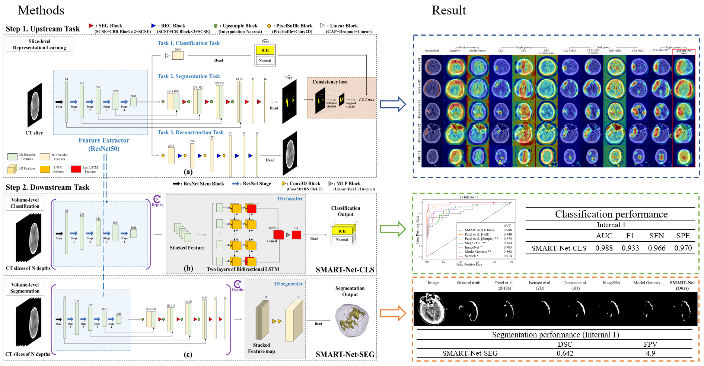

# SMART-Net - Official Pytorch Implementation

It's scheduled to be uploaded soon. We are modifying the code for easier use.
We proposed a supervised multi-task aiding representation transfer learning network called <b>SMART-Net</b>.


## 💡 Highlights
+ Develop a robust feature extractor of brain hemorrhage in head & neck NCCT through three kinds of
multi-task representation learning.
+ Propose the consistency loss to alleviate the disparity of two pretext tasks' heads, resulting in
improved transferability and representation.
Connect the feature extractor with the target-specific 3D operator via transfer learning to expand
volume-level tasks.
+ Explore relationships of the proposed multi-pretext task combinations and perform ablation studies on
optimal 3D operators for volume-level ICH tasks.
+ Validate the model on multiple datasets with previous methods and ablation studies for the robustness
and practicality of our method.
Highlights


<p align="center"></p>
<!-- <p align="center"></p> -->

## Paper
This repository provides the official implementation of training SMART-Net as well as the usage of the pre-trained SMART-Net in the following paper:

<b>Improved performance and robustness of multi-task representation learning with consistency loss between pretexts for intracranial hemorrhage identification in head CT</b> <br/>
[Sunggu Kyung](https://github.com/babbu3682)<sup>1</sup>, Keewon Shina, Hyunsu Jeongb, Ki Duk Kimb, Jooyoung Parka, Kyungjin Choa, Jeong Hyun Leec, Gil-Sun Hongc, and Namkug Kim <br/>
MI2RL LAB <br/>
<b>(Under revision...)</b> Medical Image Analysis (MedIA) <br/>
<!-- [paper](https://arxiv.org/pdf/2004.07882.pdf) | [code](https://github.com/babbu3682/SMART-Net) | [graphical abstract](https://ars.els-cdn.com/content/image/1-s2.0-S1361841520302048-fx1_lrg.jpg) -->
[code](https://github.com/babbu3682/SMART-Net)


## Requirements
+ Linux
+ Python 3.8.5
+ PyTorch 1.8.0


## 📦 SMART-Net Framework
### 1. Clone the repository and install dependencies
```bash
$ git clone https://github.com/babbu3682/SMART-Net.git
$ cd SMART-Net/
$ pip install -r requirements.txt
```

### 2. Preparing data
#### For your convenience, we have provided a few 3D nii samples from AMC dataset as well as their mask labels.
<!-- Download the data from [this repository](https://zenodo.org/record/4625321/files/TransVW_data.zip?download=1).  -->
You can use your own data using the [dicom2nift](https://github.com/icometrix/dicom2nifti) for converting from dicom to nii.

- The processed hemorrhage directory structure
```
datasets/samples/
    train
        |--  sample1_hemo_img.nii.gz
        |--  sample1_hemo_mask.nii
        |--  sample2_normal_img.nii.gz
        |--  sample2_normal_mask.nii        
                .
                .
                .
    valid
        |--  sample9_hemo_img.nii.gz
        |--  sample9_hemo_mask.nii
        |--  sample10_normal_img.nii.gz
        |--  sample10_normal_mask.nii
                .
                .
                .
    test
        |--  sample20_hemo_img.nii.gz
        |--  sample20_hemo_mask.nii
        |--  sample21_normal_img.nii.gz
        |--  sample21_normal_mask.nii
                .
                .
                .   
```

### 3. Upstream

#### 📋 Available List
- [x] Up_SMART_Net
- [x] Up_SMART_Net_Dual_CLS_SEG
- [x] Up_SMART_Net_Dual_CLS_REC
- [x] Up_SMART_Net_Dual_SEG_REC
- [x] Up_SMART_Net_Single_CLS
- [x] Up_SMART_Net_Single_SEG
- [x] Up_SMART_Net_Single_REC


**-train**: We conducted upstream training with three multi-task including classificatiom, segmentation and reconstruction.
```bash
python -W ignore self_discovery/train_autoencoder.py 
--data_dir dataset/ 
```
**-test (slice-wise for slice-level)**: We conducted upstream training with three multi-task including classificatiom, segmentation and reconstruction.
```bash
python -W ignore self_discovery/train_autoencoder.py 
--data_dir dataset/ 
```
**-test (stacking slice for volume-level)**: We conducted upstream training with three multi-task including classificatiom, segmentation and reconstruction.
```bash
python -W ignore self_discovery/train_autoencoder.py 
--data_dir dataset/ 
```

### 4. Downstream

#### 📋 Available List
- [x] Down_SMART_Net_CLS
- [x] Down_SMART_Net_SEG

#### - SMART-Net-CLS
**-train**: We conducted downstream training using multi-task representation.
```bash
python -W ignore self_discovery/train_autoencoder.py 
--data_dir dataset/ 
```
**-test**: We conducted upstream training with three multi-task including classificatiom, segmentation and reconstruction.
```bash
python -W ignore self_discovery/train_autoencoder.py 
--data_dir dataset/ 
```

#### - SMART-Net-SEG
**-train**: We conducted downstream training using multi-task representation.
```bash
python -W ignore self_discovery/train_autoencoder.py 
--data_dir dataset/ 
```
**-test**: We conducted upstream training with three multi-task including classificatiom, segmentation and reconstruction.
```bash
python -W ignore self_discovery/train_autoencoder.py 
--data_dir dataset/ 
```


## Upstream visualize
### 1. Activation map
```
⏳ It's scheduled to be uploaded soon.
```
### 2. t-SNE
```
⏳ It's scheduled to be uploaded soon.
```


## Excuse
For personal information security reasons of medical data, our data cannot be disclosed.


## 📝 Citation
If you use this code for your research, please cite our papers:
```
⏳ It's scheduled to be uploaded soon.
```

## 🤝 Acknowledgement
We build SMART-Net framework by referring to the released code at [qubvel/segmentation_models.pytorch](https://github.com/qubvel/segmentation_models.pytorch) and [Project-MONAI/MONAI](https://github.com/Project-MONAI/MONAI). 
This is a patent-pending technology.


### 🛡️ License <a name="license"></a>
Project is distributed under [MIT License](https://github.com/babbu3682/SMART-Net/blob/main/LICENSE)